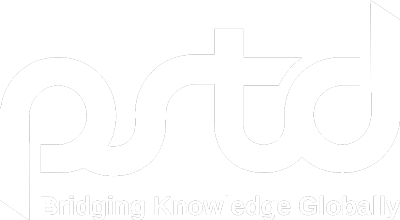
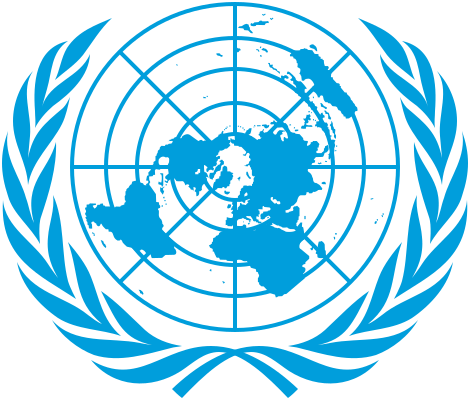

# Career & roles

Verified against [LinkedIn profile](https://www.linkedin.com/in/bismaqamar) (headline, experience dates, education, publications) and independent press where cited.

  
  &nbsp;&nbsp;
  
  &nbsp;&nbsp;
  

---

## Education

| Qualification | Institution | Dates | Location |
|---------------|-------------|-------|----------|
| **MBA** — Business Administration & Management | [Institute of Business Management (IoBM)](https://www.linkedin.com/school/iobm-official) | **2022 – 2024** | Karachi, Pakistan |
| **Merit scholarship** | *(CGPA-based)* | **Sep 2021** | — |

---

## Prime Minister’s Youth Programme (PMYP)

**Focal Person — Global Youth Affairs & United Nations Engagement**

Nominated as focal person to the **Chairman of PMYP** for global youth affairs and UN engagement ([Imroze Pakistan](https://www.imrozepakistan.com/bisma-qamar-appointed-pmyp-focal-person-for-global-youth-affairs-and-un-engagement/)). Listed on LinkedIn as **Focal person UN & Global Youth Affairs, PMYP**.

**Responsibilities (public reporting)**

- Advance youth-centered initiatives and capacity-building for young Pakistanis.
- Coordinate strategic engagement with the **United Nations** and international youth forums.
- Support **PMYP youth delegations** (e.g. ECOSOC Youth Forum 2026, New York).

**IPS byline:** *Focal Person for UN and Global Youth Affairs, PMYP* — [May 2026](https://www.ipsnews.net/2026/05/a-new-youth-generation-largest-in-history-a-decisive-force/)

---

## Pakistan Society for Training and Development (PSTD)

| Title | Dates | Location |
|-------|-------|----------|
| **Head of conferences and global learning** | Current *(LinkedIn headline)* | Karachi |
| **Comms Lead — Learning & Development** | **Jan 2024 – present** | Karachi |

PSTD: professional body for training & HR development (founded **1966**, Karachi).

**Selected responsibilities (LinkedIn)**

- Largest **DE&I-centric conference** execution across **three cities** — **2,500+ participants**, **300+ organizations**.
- **WIBCON 2024** — Islamabad & Lahore (endorsed by international collaborators).
- Spokesperson for strategic communications; focus groups with C-suite and managerial bodies.
- L&D session design with executives; DEI frameworks and roundtables.
- Youth development projects with academic institutions.
- Data analysis and impact measurement for initiatives.

**Professional email:** bisma.qamar@pstd.com.pk

---

## United Nations — National Youth Council

| Title on LinkedIn | Dates | Location |
|-------------------|-------|----------|
| **Representative To UN — National Youth Council** | **Jun 2024 – Oct 2024** (4 months) | New York, NY |

**Not UN Secretariat staff** — youth delegate / representative pathway via National Youth Council.

**Activities**

- Upskilling platforms and capacity-building content for youth.
- **IYC representative** during curation of the **Pact for the Future** (Summit of the Future).
- Content on capacity building and awareness.
- L&D programmes bridging talent and opportunity.

**Related:** 79th UN General Assembly opening (**10 Sep 2024**); Summit of the Future at UNHQ — [LinkedIn post, Sep 2024](https://www.linkedin.com/in/bismaqamar)

---

## Awaz e Bezuban Welfare Association

| Title | Dates |
|-------|-------|
| **Co-Founder** | **Aug 2019 – Oct 2024** (5 years, 2 months) |

- Led **350+ interns** for community development, outreach, and PR.
- Awareness workshops, fundraising and alumni events, database and social media campaigns.
- Training workshops across schools and colleges.
- Ongoing project: **TNVR & awareness workshops** *(LinkedIn projects: Aug 2019 – present)*

---

## Corporate & marketing experience

| Organization | Role | Dates | Location |
|--------------|------|-------|----------|
| **Retailo Technologies** | Brand & Campaigns | **Apr 2022 – Nov 2023** (1 yr 7 mo) | Riyadh, Saudi Arabia |
| **Daraz** | Brands & Campaigns | **Jun 2021 – Sep 2021** (3 mo) | Singapore *(role listed Singapore; Daraz HQ Karachi)* |
| **Tuitionhighway** | Customer Relationship Management Lead | **Apr 2019 – Jul 2019** (3 mo) | — |

**Retailo highlights:** Digital campaigns (National, Coca-Cola, Pepsi, Mondelez, Shan, Tapal, etc.); HORECA vertical launch UAE; A/B testing; **25%** funnel drop-off reduction; **18%** retention uplift on retention project; employer branding / OD across markets.

**Daraz:** Brand and campaign work (3-month engagement).

---

## Volunteer / project

| Project | Organization | Dates |
|---------|--------------|-------|
| Home salon — development & marketing strategy for underprivileged students | **The Hunar Foundation** | **Sep 2021 – Jan 2022** |

---

## Core competencies

Strategic & employer branding · DE&I conference curation · L&D programme design · Youth policy & UN forums · IPS/IDN journalism · Personal branding · CRM & digital campaigns · Community welfare leadership · Data-driven impact reporting

[← Home](README.md) · [UN & youth diplomacy →](united-nations.md)
